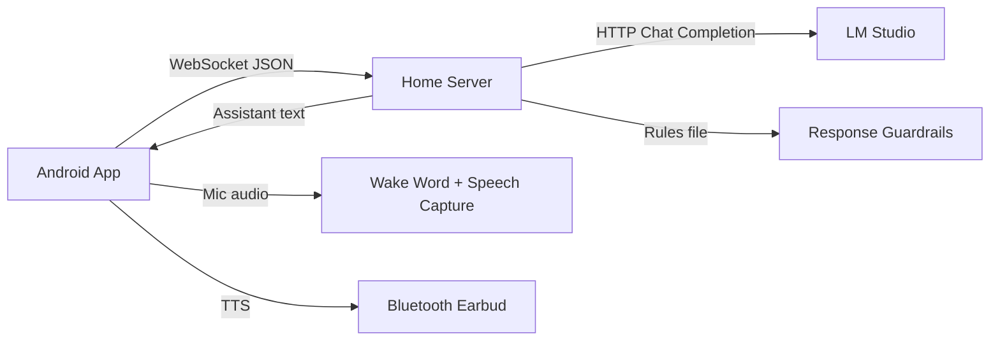

# Ear AI Assistant - System Design (v0.1)

## 1. Goals
- Android app runs as a foreground service so it can continue in pocket/screen-off mode.
- Audio I/O goes through Bluetooth earbuds (when connected) or phone microphone/speaker fallback.
- Wake flow starts only after hearing the wake phrase "Dante".
- Home computer runs a local server that:
  - Accepts phone connections.
  - Forwards prompts to LM Studio.
  - Applies response style rules from a document.
- UI is intentionally minimal:
  - Select target computer.
  - Start button.
  - Stop button.

## 2. Non-Goals (for this starter)
- Production-grade encrypted tunnel setup.
- Advanced VAD/ASR/TTS pipelines tuned for all environments.
- Full battery optimization bypass automation (user still needs to whitelist app in battery settings).

## 3. High-Level Architecture



## 4. Runtime Behavior
1. User opens app, chooses a server profile (IP/hostname + port).
2. User taps Start.
3. App starts a foreground service with microphone access.
4. Service listens continuously for wake phrase "Dante".
5. Once wake phrase is detected:
   - App captures one utterance.
   - Sends transcript text to server over WebSocket.
6. Server loads rules document, builds system prompt, forwards to LM Studio.
7. Server sends short assistant response text back.
8. App reads response via Android TextToSpeech into earbuds.
9. User taps Stop to end service.

## 5. Protocol (Phone <-> Home Server)
- Transport: WebSocket
- Endpoint: `ws://<home-server>:8765/ws/assistant`
- Message format: JSON

Client -> Server:
```json
{
  "type": "user_utterance",
  "session_id": "uuid",
  "text": "what is on my schedule today?",
  "timestamp": "2026-04-12T18:01:00Z"
}
```

Server -> Client:
```json
{
  "type": "assistant_response",
  "session_id": "uuid",
  "text": "You have one meeting at 3 PM.",
  "timestamp": "2026-04-12T18:01:02Z"
}
```

Server -> Client (errors):
```json
{
  "type": "error",
  "message": "LM Studio unavailable"
}
```

## 6. Android App Components
- `MainActivity`:
  - Simple UI (server selection, Start, Stop).
- `AudioForegroundService`:
  - Foreground notification.
  - Wake lock.
  - Wake phrase detection loop (starter implementation).
  - Speech-to-text capture.
  - WebSocket messaging.
  - TTS playback.
- `ServerProfileStore`:
  - Persist host profiles using SharedPreferences.

## 7. Home Server Components
- FastAPI app + WebSocket endpoint.
- `RulesEngine`:
  - Reads `config/assistant_rules.md`.
  - Injects rules as system prompt prefix.
- `LMStudioClient`:
  - Calls LM Studio OpenAI-compatible endpoint.
- Optional REST health endpoint for quick checks.

## 8. Safety and UX Rules
- Keep replies concise by default.
- Avoid explicit or unsafe content.
- If confidence is low, ask a brief clarification question.
- Avoid long monologues in earbud audio.

## 9. Sleep/Pocket Mode Notes
- Android requires a foreground service for persistent mic work.
- Some vendors still kill background tasks unless battery optimization is disabled.
- Bluetooth routing varies by device; app should gracefully fall back to phone speaker.

## 10. Immediate Next Milestones
1. Replace starter wake detection with dedicated offline wake-word engine (Porcupine or openWakeWord).
2. Add streaming audio protocol (optional) for lower latency.
3. Add authenticated transport (WireGuard/Tailscale or TLS + token).
4. Add reconnection strategy and network quality indicators.
